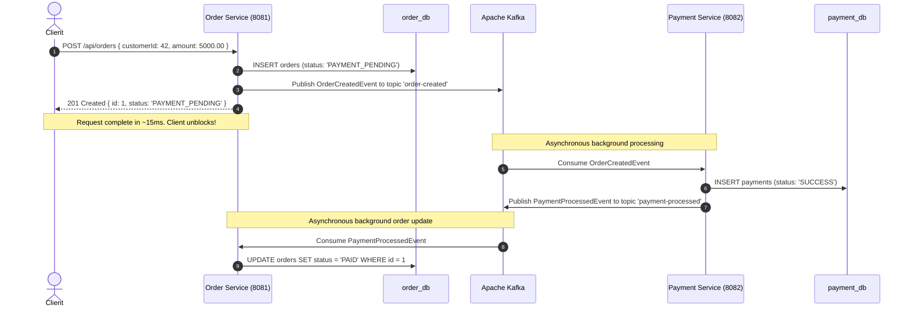

# Phase 2A: Introducing Apache Kafka and Asynchronous Event-Driven Communication

## Table of Contents
1. [Architecture Comparison: Phase 1 vs. Phase 2A](#1-architecture-comparison-phase-1-vs-phase-2a)
2. [Why Synchronous HTTP Was Used in Phase 1 & Problems Observed](#2-why-synchronous-http-was-used-in-phase-1--problems-observed)
3. [What Asynchronous Communication Means](#3-what-asynchronous-communication-means)
4. [Kafka Fundamentals Explained in PayFlow Context](#4-kafka-fundamentals-explained-in-payflow-context)
   - [What is Kafka?](#what-is-kafka)
   - [Topics & Partitions](#topics--partitions)
   - [Producers & Consumers](#producers--consumers)
   - [Consumer Groups & Offset Management](#consumer-groups--offset-management)
5. [Events vs. Entities: The Conceptual Difference](#5-events-vs-entities-the-conceptual-difference)
   - [Why `OrderCreatedEvent` is an Event, Not an `Order` Entity](#why-ordercreatedevent-is-an-event-not-an-order-entity)
   - [Why `PaymentProcessedEvent` is Emitted](#why-paymentprocessedevent-is-emitted)
   - [The Role of `eventId` in Event Design](#the-role-of-eventid-in-event-design)
6. [The New Event-Driven Request & Fulfillment Flow](#6-the-new-event-driven-request--fulfillment-flow)
7. [Temporal Decoupling: Handling Downstream Outages Gracefully](#7-temporal-decoupling-handling-downstream-outages-gracefully)
8. [The Core Distributed Flaw Remaining: The DB + Event Dual-Write Problem](#8-the-core-distributed-flaw-remaining-the-db--event-dual-write-problem)
9. [Why Kafka Alone Does NOT Guarantee End-to-End Consistency](#9-why-kafka-alone-does-not-guarantee-end-to-end-consistency)
10. [Looking Ahead: Why We Will Need Transactional Outbox & Saga Patterns](#10-looking-ahead-why-we-will-need-transactional-outbox--saga-patterns)
11. [Step-by-Step Testing & Failure Experiments Guide](#11-step-by-step-testing--failure-experiments-guide)

---

## 1. Architecture Comparison: Phase 1 vs. Phase 2A

### Phase 1: Synchronous REST Architecture
```
Client
  |
  | 1. POST /api/orders (Client BLOCKS)
  v
Order Service (8081)
  |  - Inserts Order (PAYMENT_PENDING)
  |  - BLOCKS on downstream HTTP call
  |
  | 2. POST /api/payments (HTTP REST)
  v
Payment Service (8082)
  |  - Inserts Payment (SUCCESS)
  |  - Returns HTTP 201
  v
Order Service
  |  - Updates Order to PAID
  |  - Returns HTTP 201 { status: "PAID" } to Client
  v
Client (Unblocks)
```

### Phase 2A: Asynchronous Event-Driven Architecture with Kafka
```
Client
  |
  | 1. POST /api/orders
  v
Order Service (8081)
  |  - Inserts Order (PAYMENT_PENDING) in order_db
  |  - Publishes OrderCreatedEvent to Kafka topic 'order-created'
  |  - Returns IMMEDIATELY: HTTP 201 { status: "PAYMENT_PENDING" }
  v
Client (Unblocks immediately ~10-20ms)

=========================== ASYNCHRONOUS EVENT STREAM ===========================

Kafka Topic: 'order-created'
  |
  | (Consumed asynchronously by Payment Service)
  v
Payment Service (8082) [Consumer Group: payment-service-group]
  |  - Reads OrderCreatedEvent
  |  - Processes payment logic
  |  - Inserts Payment record (SUCCESS / FAILED) in payment_db
  |  - Publishes PaymentProcessedEvent to Kafka topic 'payment-processed'
  v
Kafka Topic: 'payment-processed'
  |
  | (Consumed asynchronously by Order Service)
  v
Order Service (8081) [Consumer Group: order-service-group]
  |  - Reads PaymentProcessedEvent
  |  - Updates Order in order_db to PAID (if SUCCESS) or PAYMENT_FAILED (if FAILED)
```

---

## 2. Why Synchronous HTTP Was Used in Phase 1 & Problems Observed

In Phase 1, synchronous REST was chosen as the intuitive starting baseline. However, running Phase 1 exposed three critical distributed system bottlenecks:

1. **Thread Blocking & Latency Accumulation:**
   - In synchronous REST, the Tomcat worker thread serving the client request in `order-service` is locked while waiting for `payment-service` to respond over the network.
   - Total latency = `Order DB Write Latency` + `Network Latency` + `Payment DB Write Latency` + `Network Latency`.
   - Under heavy checkout traffic, threads quickly exhaust, leading to HTTP 504 gateway timeouts.

2. **Cascading Outages (Tight Temporal Coupling):**
   - If `payment-service` crashed, deployed a rolling update, or became temporarily unreachable, `order-service` immediately failed all checkout requests.
   - An issue in a downstream auxiliary service brought down the entire customer-facing storefront.

3. **Inability to Smooth Traffic Spikes (No Buffering):**
   - If 10,000 customers place an order in 1 second during a flash sale, `payment-service` is hammered with 10,000 concurrent HTTP requests simultaneously, causing database connection pool exhaustion and crashes.

---

## 3. What Asynchronous Communication Means

**Asynchronous event-driven communication** inverts the communication model:
- **Fire-and-Forget / Event Emission:** Instead of asking `payment-service` to process a payment right now and waiting for a reply, `order-service` states a fact: *"An order was created with ID 101 for $5,000."*
- **Non-blocking Execution:** `order-service` records the order locally, emits the event to an intermediary message log (Kafka), and immediately responds to the user.
- **Decoupled Lifecycle:** `payment-service` consumes and processes events at its own pace whenever it is ready.

---

## 4. Kafka Fundamentals Explained in PayFlow Context

### What is Kafka?
Apache Kafka is a **distributed, append-only, immutable commit log**. Unlike traditional message queues (like RabbitMQ or JMS) which delete messages once acknowledged, Kafka persists all records on disk in an ordered log for a configurable retention period.

### Topics & Partitions
- **Topic:** A named category or feed to which records are published. In PayFlow Phase 2A, we have two topics:
  1. `order-created`: Holds events emitted when orders are placed.
  2. `payment-processed`: Holds events emitted when payments are completed.
- **Partition:** A topic is divided into one or more partitions for parallel processing and horizontal scalability. Records within a partition have a strict sequential order.

### Producers & Consumers
- **Producer:** An application that writes records to a Kafka topic. In PayFlow:
  - `order-service` is a producer for `order-created`.
  - `payment-service` is a producer for `payment-processed`.
- **Consumer:** An application that subscribes to topics and reads records from the log. In PayFlow:
  - `payment-service` is a consumer for `order-created`.
  - `order-service` is a consumer for `payment-processed`.

### Consumer Groups & Offset Management
- **Consumer Group:** A set of consumers cooperating to consume data from topics.
  - `payment-service` belongs to `payment-service-group`.
  - `order-service` belongs to `order-service-group`.
- **Consumer Offset:** An integer pointing to the sequential position of the last record read by a consumer group in a partition.
- **Why Consumer Groups Matter:**
  - If we scale `payment-service` from 1 instance to 3 instances, Kafka automatically assigns partitions among them without duplicate processing.
  - If a consumer crashes, when it restarts, it reads its committed offset and resumes exactly where it left off without losing messages.

---

## 5. Events vs. Entities: The Conceptual Difference

### Why `OrderCreatedEvent` is an Event, Not an `Order` Entity
A common anti-pattern in distributed systems is serializing the database JPA entity (e.g. `Order.java`) directly over Kafka. We intentionally avoid this:

1. **Information Encapsulation:** The internal schema of `order_db` (table names, internal JPA version columns, database annotations) is private to `order-service`. Exposing entities directly leaks database details.
2. **Contract Stability (Public API):** An event represents a public business contract. Fields in `OrderCreatedEvent` are versionable, explicit, and immune to internal refactoring of database column types.
3. **Temporal Fact:** An entity represents the *current mutable state* of a record. An event represents an *immutable fact that happened in the past*.

### Why `PaymentProcessedEvent` is Emitted
`payment-service` emits `PaymentProcessedEvent` containing the payment outcome (`SUCCESS` or `FAILED`), `paymentId`, and `orderId`. This informs `order-service` to transition the order state without `payment-service` having any direct awareness of order domain tables.

### The Role of `eventId` in Event Design
Every event payload contains a unique `eventId: UUID`. In distributed systems:
- Networks and brokers offer **at-least-once delivery** semantics.
- A consumer might receive the same event twice (e.g. during consumer rebalancing or network retries).
- Having a unique `eventId` allows consumers in later phases to implement **Idempotency** (ignoring duplicate events).

---

## 6. The New Event-Driven Request & Fulfillment Flow



---

## 7. Temporal Decoupling: Handling Downstream Outages Gracefully

In Phase 1, stopping `payment-service` caused checkout to immediately fail (`503 Service Unavailable`).

In Phase 2A, **Temporal Decoupling** protects the checkout experience:
1. Stop `payment-service`.
2. A customer submits `POST /api/orders`.
3. `order-service` writes the order to `order_db` (`PAYMENT_PENDING`), publishes `OrderCreatedEvent` to Kafka, and returns `201 Created`.
4. Kafka safely buffers the message on disk in the `order-created` topic.
5. 10 minutes later, `payment-service` is started.
6. `payment-service` immediately fetches all buffered messages starting from its last committed offset, executes payments, and emits `PaymentProcessedEvent`.
7. `order-service` receives the payment outcomes and updates the orders to `PAID`.
8. **Result:** Zero downtime for customer checkouts during backend maintenance!

---

## 8. The Core Distributed Flaw Remaining: The DB + Event Dual-Write Problem

Even though Kafka solves thread blocking and temporal coupling, **introducing Kafka alone does NOT make the architecture fully reliable.**

We have intentionally left the **Dual-Write Problem** in place:

```
                  POST /api/orders
                         |
                         v
          +------------------------------+
          | Step 1: Write to order_db    |  --->  SUCCESS (Committed)
          +------------------------------+
                         |
                         v
                    [ CRASH / ]
                    [ NETWORK ]
                    [ BROKER  ]
                    [ TIMEOUT ]
                         |
                         X
          +------------------------------+
          | Step 2: Publish to Kafka     |  --->  FAILED! (No event sent)
          +------------------------------+
```

### The Inconsistency:
- In `order_db`, Order #101 exists with status `PAYMENT_PENDING`.
- Because the Kafka publish failed (due to network timeout, broker crash, or process termination), `OrderCreatedEvent` was never sent to Kafka.
- `payment-service` will **never** receive the event.
- The order is permanently stuck in `PAYMENT_PENDING` forever.
- No payment is ever processed, and no failure notification is ever sent.

---

## 9. Why Kafka Alone Does NOT Guarantee End-to-End Consistency

Why can't Spring's `@Transactional` save us here?
- Database transactions use the JDBC protocol (PostgreSQL WAL).
- Kafka publishing uses Kafka's binary TCP protocol.
- There is **no atomic distributed commit** between PostgreSQL and Kafka.
- If an exception occurs during `kafkaTemplate.send()`, the database transaction can roll back *only if* they are wrapped synchronously in the same method, but if the application crashes *after* the DB commits and *before* the broker acknowledges, the event is permanently lost or duplicated.

---

## 10. Looking Ahead: Why We Will Need Transactional Outbox & Saga Patterns

Phase 2A clearly demonstrates the boundary of what message brokers can and cannot do:

| Problem | Status in Phase 2A | Future Solution (Phase 3+) |
|---|---|---|
| **Thread Blocking & Latency** | **Solved by Kafka** (Non-blocking async messaging) | Kafka Event Streaming |
| **Downstream Outages** | **Solved by Kafka** (Temporal decoupling & disk buffering) | Kafka Consumer Offsets |
| **DB + Kafka Dual-Write Bug** | **Exposed in Phase 2A** (DB commits, event lost on crash) | **Transactional Outbox Pattern** |
| **Distributed Multi-Step Rollback** | **Exposed in Phase 2A** (No compensation if later steps fail) | **Saga Pattern (Compensating Transactions)** |

---

## 11. Step-by-Step Testing & Failure Experiments Guide

### 1. Build and Run All Services via Docker Compose
```bash
docker-compose up --build
```
Verify the following services are running:
- `payflow-order-db` (Port 5432)
- `payflow-payment-db` (Port 5433)
- `payflow-kafka` (Port 9092)
- `payflow-order-service` (Port 8081)
- `payflow-payment-service` (Port 8082)

---

### 2. Test Case 1: Asynchronous Happy Path

**Command:**
```bash
curl -i -X POST http://localhost:8081/api/orders \
  -H "Content-Type: application/json" \
  -d '{
    "customerId": 42,
    "amount": 5000.00
  }'
```

**Immediate HTTP Response (`201 Created` within ~20ms):**
```json
{
  "id": 1,
  "customerId": 42,
  "amount": 5000.00,
  "status": "PAYMENT_PENDING"
}
```

**Check State After 1-2 Seconds:**
```bash
curl http://localhost:8081/api/orders/1
```
**Response:**
```json
{
  "id": 1,
  "customerId": 42,
  "amount": 5000.00,
  "status": "PAID"
}
```

**Check Payment Record:**
```bash
curl http://localhost:8082/api/payments/order/1
```
**Response:**
```json
[
  {
    "id": 1,
    "orderId": 1,
    "amount": 5000.00,
    "status": "SUCCESS"
  }
]
```

---

### 3. Test Case 2: Asynchronous Simulated Payment Failure

**Command:**
```bash
curl -i -X POST http://localhost:8081/api/orders \
  -H "Content-Type: application/json" \
  -d '{
    "customerId": 42,
    "amount": 5000.00,
    "simulatePaymentFailure": true
  }'
```

**Immediate HTTP Response:**
```json
{
  "id": 2,
  "customerId": 42,
  "amount": 5000.00,
  "status": "PAYMENT_PENDING"
}
```

**Check State After 1-2 Seconds:**
```bash
curl http://localhost:8081/api/orders/2
```
**Response:**
```json
{
  "id": 2,
  "customerId": 42,
  "amount": 5000.00,
  "status": "PAYMENT_FAILED"
}
```

---

### 4. Test Case 3: Temporal Decoupling Verification (Payment Service Offline)

1. Stop `payment-service`:
   ```bash
   docker-compose stop payment-service
   ```
2. Place an order:
   ```bash
   curl -i -X POST http://localhost:8081/api/orders \
     -H "Content-Type: application/json" \
     -d '{
       "customerId": 42,
       "amount": 3500.00
     }'
   ```
   **Result:** Order created with `PAYMENT_PENDING` (No 503 error! Request succeeds!).
3. Query order: `GET http://localhost:8081/api/orders/3` -> Status is `PAYMENT_PENDING`.
4. Restart `payment-service`:
   ```bash
   docker-compose start payment-service
   ```
5. Query order after 2 seconds: `GET http://localhost:8081/api/orders/3` -> Status automatically transitions to `PAID` as the consumer catches up with its offset!

---

### 5. Test Case 4: Dual-Write Failure Simulation (The Problem for Phase 3)

**Command:**
```bash
curl -i -X POST http://localhost:8081/api/orders \
  -H "Content-Type: application/json" \
  -d '{
    "customerId": 42,
    "amount": 5000.00,
    "simulateKafkaPublishFailure": true
  }'
```

**Result:**
- `order_db` contains Order #4 with status `PAYMENT_PENDING`.
- Kafka never receives the message.
- `payment-service` never processes the payment.
- Order #4 is orphaned in `PAYMENT_PENDING` forever.
- **Direct proof that the Transactional Outbox Pattern is required!**
