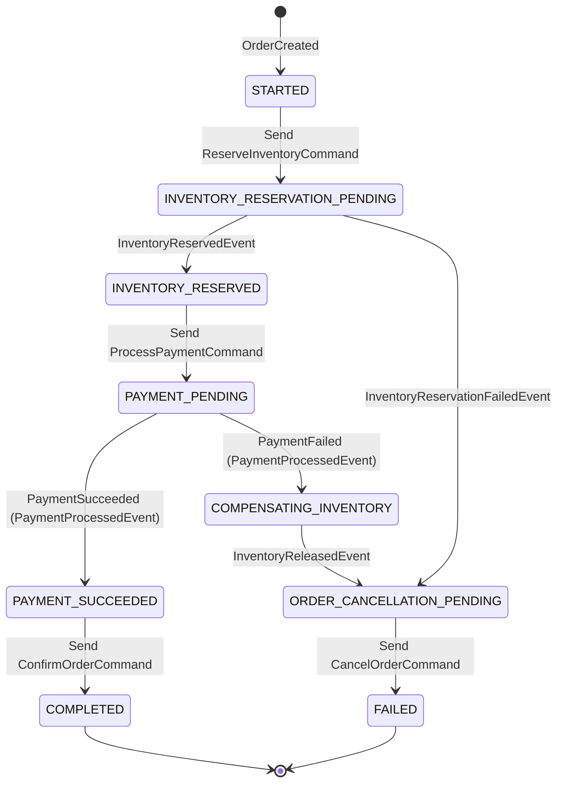

# Phase 2B: Distributed Sagas Using Orchestration

## Table of Contents
1. [Why Saga is Needed](#1-why-saga-is-needed)
2. [The Problem with Distributed Transactions (2PC / XA)](#2-the-problem-with-distributed-transactions-2pc--xa)
3. [Local Transactions vs. Distributed ACID](#3-local-transactions-vs-distributed-acid)
4. [Saga Pattern Definition](#4-saga-pattern-definition)
5. [Orchestration vs. Choreography](#5-orchestration-vs-choreography)
6. [Why This Project Uses Orchestration](#6-why-this-project-uses-orchestration)
7. [System Architecture in Phase 2B](#7-system-architecture-in-phase-2b)
8. [Saga State Machine](#8-saga-state-machine)
9. [Happy Path Workflow](#9-happy-path-workflow)
10. [Failure & Compensation Workflows](#10-failure--compensation-workflows)
    - [Case A: Payment Failure with Inventory Compensation](#case-a-payment-failure-with-inventory-compensation)
    - [Case B: Inventory Reservation Failure](#case-b-inventory-reservation-failure)
11. [Why Compensation is NOT a Database Rollback](#11-why-compensation-is-not-a-database-rollback)
12. [Kafka Topics & Consumer Groups Architecture](#12-kafka-topics--consumer-groups-architecture)
13. [Commands vs. Events: The Critical Distinction](#13-commands-vs-events-the-critical-distinction)
14. [Correlation with `sagaId`](#14-correlation-with-sagaid)
15. [Database Ownership & Strict Isolation](#15-database-ownership--strict-isolation)
16. [What the Saga Pattern Does NOT Solve](#16-what-the-saga-pattern-does-not-solve)
17. [Why Transactional Outbox is Still Needed (Phase 2C Preview)](#17-why-transactional-outbox-is-still-needed-phase-2c-preview)
18. [Why Idempotency is Still Needed (Phase 2D Preview)](#18-why-idempotency-is-still-needed-phase-2d-preview)
19. [How to Run & Test Phase 2B](#19-how-to-run--test-phase-2b)

---

## 1. Why Saga is Needed

In a monolithic architecture, a customer checkout operation (creating an order, deducting inventory, processing a payment) runs inside a single database transaction:
```sql
BEGIN TRANSACTION;
  INSERT INTO orders ...;
  UPDATE inventory SET available = available - 1 WHERE product_id = 1001;
  INSERT INTO payments ...;
COMMIT;
```
If any statement fails, the database automatically rolls back all changes atomically, adhering strictly to **ACID** (Atomicity, Consistency, Isolation, Durability) guarantees.

In our microservices architecture, however:
- **Order Service** owns `order_db`
- **Inventory Service** owns `inventory_db`
- **Payment Service** owns `payment_db`

There is no shared physical database. Therefore, a single database `BEGIN ... COMMIT` cannot span across three separate database processes over a network. The Saga pattern provides a mechanism to maintain eventual data consistency across multiple independent services and databases.

---

## 2. The Problem with Distributed Transactions (2PC / XA)

Historically, distributed systems attempted to maintain ACID properties using **Two-Phase Commit (2PC)** / XA protocols with a distributed transaction manager:
```
           Coordinator
          /     |     \
   Prepare?  Prepare?  Prepare?  (Phase 1: Voting)
        v       v       v
      DB 1    DB 2    DB 3   (Acquires locks on records)
        \       |       /
    Commit!  Commit!  Commit!    (Phase 2: Execution)
```

### Why 2PC Fails in Modern Distributed Cloud Systems:
1. **Blocking Latency:** All participant databases lock rows during Phase 1 until the coordinator sends the Phase 2 commit. Under high throughput, database thread pools and row locks starve the entire system.
2. **Single Point of Failure:** If the coordinator crashes between Phase 1 and Phase 2, participant databases hold locks indefinitely, freezing downstream transactions.
3. **Incompatible with Asynchronous Messaging:** 2PC requires synchronous coordination and is virtually unsupported by modern horizontally scalable message brokers (like Apache Kafka).
4. **Violates the CAP Theorem:** In network partitions, 2PC chooses strict Consistency over Availability, causing cascading outages across microservices.

---

## 3. Local Transactions vs. Distributed ACID

Instead of attempting one impossible distributed ACID transaction, the **Saga Pattern** breaks the business workflow into a sequence of **local database transactions**:

```
+-------------------------------------------------------------------------+
|                              SAGA WORKFLOW                              |
|                                                                         |
|  [Local Tx 1]              [Local Tx 2]              [Local Tx 3]       |
|  Order Service ----------> Inventory Service -------> Payment Service   |
|  (order_db)                (inventory_db)             (payment_db)      |
+-------------------------------------------------------------------------+
```

1. Each microservice executes an atomic local transaction within its own database.
2. When the local transaction finishes, an event is emitted or received via Kafka.
3. The next service is triggered to execute its local transaction.
4. If a step fails, **compensating transactions** are executed in reverse order to undo the changes made by earlier local transactions.

---

## 4. Saga Pattern Definition

A **Saga** is a sequence of local transactions:
$$T_1, T_2, T_3, \dots, T_n$$

Where each transaction $T_i$ updates data in a single service. For every transaction $T_i$, there exists a corresponding **compensating transaction** $C_i$ that semantically reverses the effects of $T_i$:
$$C_i \text{ compensates } T_i$$

- If all $T_1 \dots T_n$ succeed: The Saga finishes successfully with **Eventual Consistency**.
- If transaction $T_k$ fails ($k \le n$): The system executes compensating transactions in reverse:
  $$C_{k-1}, C_{k-2}, \dots, C_1$$
  bringing the system back to a clean, balanced state.

---

## 5. Orchestration vs. Choreography

| Feature | Choreography (Phase 2A) | Orchestration (Phase 2B) |
|---|---|---|
| **Coordination** | Decentralized; services react to each other's events directly | Centralized; a dedicated Orchestrator coordinates the workflow |
| **Coupling** | Services must know downstream event schemas and next steps | Services only know their own domain commands and results |
| **Observability** | Difficult; workflow state is distributed across multiple logs | Simple; Orchestrator persists the exact state of each Saga instance |
| **Compensation** | Complex; circular event ping-pong between services | Straightforward; Orchestrator decides who to compensate and when |
| **Best suited for** | Simple 2-step notifications | Complex multi-step business transactions (Order -> Inventory -> Payment) |

---

## 6. Why This Project Uses Orchestration

In Phase 2A, we observed that even with just two services (`Order` and `Payment`), choreography required Order Service to listen to Payment events and Payment Service to listen to Order events.

Adding a third service (`Inventory`) to choreography would cause an explosion of cross-service event dependencies:
- Should Payment listen to Inventory?
- Should Order listen to Inventory?
- Who triggers the release of inventory when payment fails?

With **Orchestration**:
1. **Separation of Concerns:** `InventoryService` only knows how to reserve and release inventory. `PaymentService` only knows how to process payments.
2. **Central State Ownership:** The `Saga Orchestrator` is the single source of truth for "What state is Order #101 in?" and "What step happens next?".
3. **No Circular Dependencies:** Services do not call or listen to each other directly; they only communicate with the Orchestrator via Kafka.

---

## 7. System Architecture in Phase 2B

```
                             Client
                               |
                               | 1. POST /api/orders
                               v
                         Order Service (:8081)
                               |
                               | 2. OrderCreatedEvent
                               v
                     Kafka ('order-created')
                               |
                               v
+-------------------------------------------------------------+
|                  Saga Orchestrator (:8084)                  |
|                        (saga_db)                            |
|                                                             |
|  Tracks SagaInstance State Machine:                         |
|  STARTED -> INVENTORY_PENDING -> INVENTORY_RESERVED         |
|  -> PAYMENT_PENDING -> COMPLETED (or COMPENSATING)          |
+-------------------------------------------------------------+
          |                         |                        |
          | 3. ReserveInventory     | 6. ProcessPayment      | 9. ConfirmOrder
          v                         v                        v
 Kafka ('inventory-command') Kafka ('payment-command') Kafka ('order-command')
          |                         |                        |
          v                         v                        v
  Inventory Service         Payment Service          Order Service
       (:8083)                   (:8082)                  (:8081)
          |                         |                        |
          v                         v                        v
    inventory_db               payment_db                 order_db
          |                         |
          | 4. InventoryReserved    | 7. PaymentSucceeded
          v                         v
 Kafka ('inventory-result')  Kafka ('payment-result')
          |                         |
          +-------------------------+
                               |
                               v
                   (Back to Saga Orchestrator)
```

---

## 8. Saga State Machine

The `SagaInstance` entity in `saga_db` tracks the exact progression through this state machine:



### State Explanations:
- `STARTED`: Saga instance created upon receiving `OrderCreatedEvent`.
- `INVENTORY_RESERVATION_PENDING`: `ReserveInventoryCommand` dispatched to `inventory-command`.
- `INVENTORY_RESERVED`: Inventory successfully locked in `inventory_db`.
- `PAYMENT_PENDING`: `ProcessPaymentCommand` dispatched to `payment-command`.
- `PAYMENT_SUCCEEDED`: Payment record saved in `payment_db` with `SUCCESS`.
- `COMPENSATING_INVENTORY`: Payment failed! Orchestrator sends `ReleaseInventoryCommand`.
- `ORDER_CANCELLATION_PENDING`: Compensation finished or inventory failed; orchestrator sends `CancelOrderCommand`.
- `COMPLETED`: Happy path finished. Order confirmed as `PAID`.
- `FAILED`: Failure workflow finished. Status set to `FAILED` or `COMPENSATED`.

---

## 9. Happy Path Workflow

```
Client         OrderService       SagaOrchestrator      InventoryService      PaymentService
  |                 |                     |                     |                   |
  |-- POST /orders >|                     |                     |                   |
  |   (status=PEND) |                     |                     |                   |
  |<-- 201 Created -|                     |                     |                   |
  |                 |-- OrderCreated ---->|                     |                   |
  |                 |   (topic: order-cr) |                     |                   |
  |                 |                     |-- ReserveInventory >|                   |
  |                 |                     |   (topic: inv-cmd)  |                   |
  |                 |                     |                     |-- (Local DB Tx:   |
  |                 |                     |                     |    stock reserved)|
  |                 |                     |<-- InventoryResrv --|                   |
  |                 |                     |    (topic: inv-res) |                   |
  |                 |                     |                     |                   |
  |                 |                     |-- ProcessPayment ---------------------->|
  |                 |                     |   (topic: pay-cmd)  |                   |
  |                 |                     |                     |                   |-- (Local DB Tx:
  |                 |                     |                     |                   |    payment success)
  |                 |                     |<-- PaymentSucceeded --------------------|
  |                 |                     |    (topic: pay-res) |                   |
  |                 |                     |                     |                   |
  |                 |<- ConfirmOrder -----|                     |                   |
  |                 |   (topic: ord-cmd)  |                     |                   |
  |                 |-- (Local DB Tx:     |                     |                   |
  |                 |    status=PAID)     |                     |                   |
  |                 |                     | (Saga COMPLETED)    |                   |
```

---

## 10. Failure & Compensation Workflows

### Case A: Payment Failure with Inventory Compensation
When payment processing fails (e.g., credit card declined or `simulatePaymentFailure: true`):

```
OrderService       SagaOrchestrator      InventoryService      PaymentService
     |                    |                     |                   |
     |                    |-- ReserveInventory >|                   |
     |                    |<-- InventoryResrv --| (Stock reserved)  |
     |                    |                     |                   |
     |                    |-- ProcessPayment ---------------------->|
     |                    |                                         |-- (Tx: FAILED)
     |                    |<-- PaymentFailed -----------------------|
     |                    |
     |                    | === COMPENSATION PHASE INITIATED ===
     |                    |
     |                    |-- ReleaseInventory >|
     |                    |   (topic: inv-cmd)  |-- (Local DB Tx:
     |                    |                     |    restore stock)
     |                    |<-- InventoryReleased|
     |                    |    (topic: inv-res) |
     |                    |
     |<- CancelOrder -----|
     |   (topic: ord-cmd) |
     |-- (Local DB Tx:    |
     |    status=CANCEL)  |
     |                    | (Saga FAILED / COMPENSATED)
```

### Case B: Inventory Reservation Failure
When inventory is out of stock (e.g. Product 1002 with 0 units or `simulateInventoryFailure: true`):
1. Order created in `order_db` with `PAYMENT_PENDING`.
2. Saga Orchestrator sends `ReserveInventoryCommand`.
3. Inventory Service discovers insufficient stock, publishes `InventoryReservationFailedEvent`.
4. Orchestrator skips payment entirely!
5. Orchestrator sends `CancelOrderCommand` to Order Service.
6. Order is marked `CANCELLED`.
7. Saga finishes as `FAILED` (no inventory compensation was needed because no inventory was ever reserved).

---

## 11. Why Compensation is NOT a Database Rollback

> [!IMPORTANT]
> A common misconception is that compensation "rolls back" the database. It does **NOT**.

- **Database Rollback:** Uses undo logs inside a single database session to discard uncommitted changes before `COMMIT`. The uncommitted changes were never visible to other transactions.
- **Compensating Transaction:** An **entirely new, independent, committed transaction** that semantically counterbalances the business effect of a previous transaction.
  - In `reserveInventory`: `availableQuantity = 50 - 1 = 49`, `reservedQuantity = 0 + 1 = 1`. (Committed to disk).
  - In `releaseInventory`: `availableQuantity = 49 + 1 = 50`, `reservedQuantity = 1 - 1 = 0`. (A separate commit to disk).
- Between the reservation and compensation, other transactions could observe that the item was reserved. This is why Sagas provide **Eventual Consistency**, not instantaneous ACID isolation.

---

## 12. Kafka Topics & Consumer Groups Architecture

| Topic | Channel Type | Message Class | Producer | Consumer Group | Consumer Service |
|---|---|---|---|---|---|
| `order-created` | Event | `OrderCreatedEvent` | `order-service` | `saga-orchestrator-group` | `saga-orchestrator` |
| `inventory-command` | Command | `InventoryCommand` | `saga-orchestrator` | `inventory-service-group` | `inventory-service` |
| `inventory-result` | Event | `InventoryResultEvent` | `inventory-service` | `saga-orchestrator-group` | `saga-orchestrator` |
| `payment-command` | Command | `ProcessPaymentCommand` | `saga-orchestrator` | `payment-service-group` | `payment-service` |
| `payment-result` | Event | `PaymentProcessedEvent` | `payment-service` | `saga-orchestrator-group` | `saga-orchestrator` |
| `order-command` | Command | `OrderCommand` | `saga-orchestrator` | `order-service-group` | `order-service` |

---

## 13. Commands vs. Events: The Critical Distinction

In event-driven architectures, conflating commands and events causes severe architectural rot:

### 1. Command ("Do this action")
- **Intent:** Directive asking a specific service to execute an action.
- **Expectation:** The sender expects the recipient to perform business logic.
- **Naming:** Imperative verb phrase (e.g. `ReserveInventory`, `ProcessPayment`, `CancelOrder`).
- **Destination:** Typically targeted to a single consuming service.

### 2. Event ("This already happened")
- **Intent:** Notification stating an immutable fact that occurred in the past.
- **Expectation:** The sender does not dictate who reacts to the fact or what they do.
- **Naming:** Past tense verb phrase (e.g. `OrderCreated`, `InventoryReserved`, `PaymentFailed`).
- **Destination:** Broadcast to any interested subscriber.

In PayFlow Phase 2B:
- Orchestrator sends **Commands** to worker services.
- Worker services emit **Events** containing the outcomes back to the Orchestrator.

---

## 14. Correlation with `sagaId`

In a high-throughput system, thousands of orders execute concurrently. When a `PaymentProcessedEvent` arrives on Kafka, how does the Orchestrator know which order and which saga instance it belongs to?

### The Correlation Identifier:
1. Every Saga workflow is assigned a unique `sagaId` (UUID) upon `OrderCreatedEvent`.
2. The `sagaId` is embedded in **every single command and event**:
   - `OrderCreatedEvent(sagaId="9f3a...", ...)`
   - `ReserveInventoryCommand(sagaId="9f3a...", ...)`
   - `InventoryResultEvent(sagaId="9f3a...", ...)`
   - `ProcessPaymentCommand(sagaId="9f3a...", ...)`
   - `PaymentProcessedEvent(sagaId="9f3a...", ...)`
   - `OrderCommand(sagaId="9f3a...", ...)`
3. When the Orchestrator consumes any result event, it queries `sagaInstanceRepository.findBySagaId(event.getSagaId())` to load the exact state machine instance and execute the next transition.

---

## 15. Database Ownership & Strict Isolation

Phase 2B strictly enforces the **Database-per-Service** pattern:

| Microservice | Port | Database | Host DB Port | Allowed Access |
|---|---|---|---|---|
| `order-service` | 8081 | `order_db` | 5432 | Exclusively `order-service` |
| `payment-service` | 8082 | `payment_db` | 5433 | Exclusively `payment-service` |
| `inventory-service` | 8083 | `inventory_db` | 5434 | Exclusively `inventory-service` |
| `saga-orchestrator` | 8084 | `saga_db` | 5435 | Exclusively `saga-orchestrator` |

> [!CAUTION]
> Under no circumstances does `saga-orchestrator` query or mutate `order_db`, `payment_db`, or `inventory_db` directly via JDBC/SQL. All interactions are strictly mediated through Kafka messages.

---

## 16. What the Saga Pattern Does NOT Solve

While the Saga pattern solves the challenge of cross-service coordination and rollback, it introduces distributed edge cases that require subsequent architectural patterns:

1. **Lack of Isolation (ACID 'I'):** Other transactions can read intermediate states while a Saga is still in-flight (dirty reads / phantom reads).
2. **The Dual-Write Problem:** If a service writes to its local DB and crashes before publishing the Kafka event/command, the system gets stuck.
3. **Duplicate Messages (At-Least-Once Delivery):** If Kafka redelivers a command, a service might reserve inventory or charge payment twice unless protected by idempotency.

---

## 17. Why Transactional Outbox is Still Needed (Phase 2C Preview)

In Phase 2B, `order-service` still performs:
```java
Order order = saveInitialOrder(request); // Local DB write
orderEventProducer.sendOrderCreatedEvent(event); // Kafka network call
```
If the JVM process crashes, the network breaks, or the Kafka broker times out immediately after the DB write, the order is saved in `order_db` but the event is never sent to Kafka. The Saga never starts, and the order is orphaned in `PAYMENT_PENDING` forever.

**Phase 2C will solve this using the Transactional Outbox Pattern**: Writing both the business entity and an outbox event in the same atomic database transaction.

---

## 18. Why Idempotency is Still Needed (Phase 2D Preview)

Kafka provides **at-least-once** delivery. Network blips, broker rebalances, or consumer restarts can cause Kafka to deliver the exact same command twice.
If `ProcessPaymentCommand` or `ReserveInventoryCommand` is consumed twice:
- Inventory might be decremented twice for one order.
- The customer might be charged twice.

**Phase 2D will solve this using an Idempotency Framework** with unique request keys to ensure that processing the same command multiple times produces the exact same outcome without side effects.

---

## 19. How to Run & Test Phase 2B

### 1. Build and Run All Services via Docker Compose
```bash
docker-compose up --build
```

### 2. Test Case 1: Happy Path (Saga Completion)
**Step 1: Place an order**
```bash
curl -i -X POST http://localhost:8081/api/orders \
  -H "Content-Type: application/json" \
  -d '{
    "customerId": 42,
    "amount": 5000.00,
    "productId": 1001,
    "quantity": 1
  }'
```
**Step 2: Check Saga Orchestrator State**
```bash
curl http://localhost:8084/api/sagas/order/1
```
Expected: `currentState: "COMPLETED"`, `status: "COMPLETED"`.

**Step 3: Check Order Status**
```bash
curl http://localhost:8081/api/orders/1
```
Expected: `status: "PAID"`.

**Step 4: Check Inventory Deduction**
```bash
curl http://localhost:8083/api/inventory/1001
```
Expected: `availableQuantity` decremented from 50 to 49.

---

### 3. Test Case 2: Payment Failure & Compensation
**Step 1: Place an order simulating payment failure**
```bash
curl -i -X POST http://localhost:8081/api/orders \
  -H "Content-Type: application/json" \
  -d '{
    "customerId": 42,
    "amount": 5000.00,
    "productId": 1001,
    "quantity": 1,
    "simulatePaymentFailure": true
  }'
```
**Step 2: Check Saga Orchestrator State**
```bash
curl http://localhost:8084/api/sagas/order/2
```
Expected: `currentState: "FAILED"`, `status: "COMPENSATED"`, `failureReason: "Payment failed for order #2"`.

**Step 3: Check Inventory Released (Compensated)**
```bash
curl http://localhost:8083/api/inventory/1001
```
Expected: `availableQuantity` restored to 49 (not 48!). `reservedQuantity: 0`.

**Step 4: Check Order Status**
```bash
curl http://localhost:8081/api/orders/2
```
Expected: `status: "CANCELLED"`.

---

### 4. Test Case 3: Out-of-Stock Failure (No Compensation Needed)
**Step 1: Place an order for Product 1002 (Out of stock)**
```bash
curl -i -X POST http://localhost:8081/api/orders \
  -H "Content-Type: application/json" \
  -d '{
    "customerId": 42,
    "amount": 5000.00,
    "productId": 1002,
    "quantity": 1
  }'
```
**Step 2: Check Saga Orchestrator State**
```bash
curl http://localhost:8084/api/sagas/order/3
```
Expected: `currentState: "FAILED"`, `status: "FAILED"`, `failureReason: "Inventory reservation failed: INSUFFICIENT_STOCK"`.

**Step 3: Check Order Status**
```bash
curl http://localhost:8081/api/orders/3
```
Expected: `status: "CANCELLED"`.
